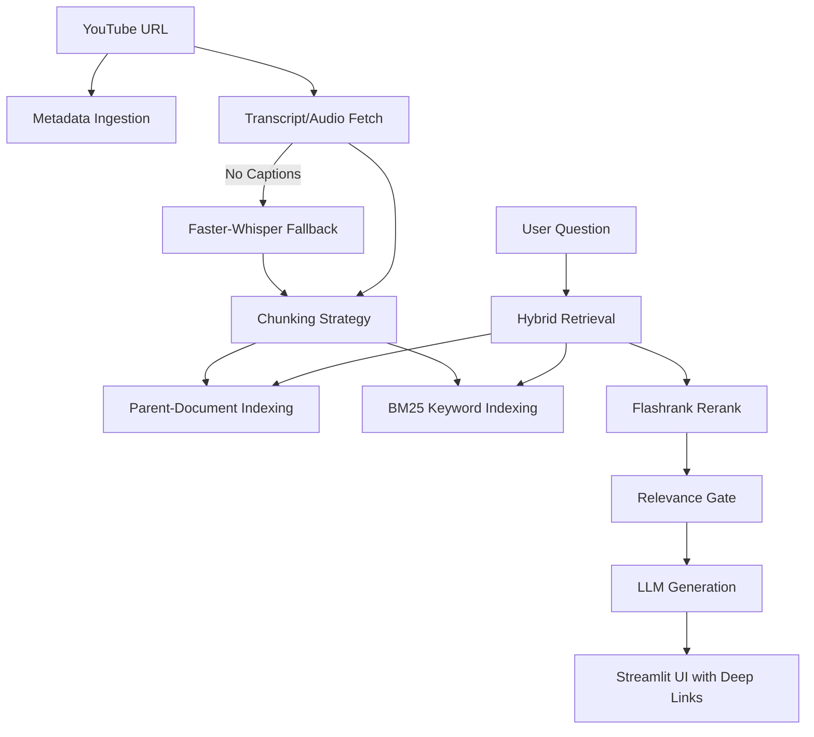

# 🎥 YouTube AI Chatbot & Advanced RAG Pipeline

**Ask questions about any YouTube video and get precise, timestamped AI insights.**

This project features a production-grade Retrieval-Augmented Generation (RAG) pipeline designed to extract intelligence from YouTube videos. It handles everything from metadata ingestion to local audio transcription (Whisper) and advanced hybrid search.

---

## 🚀 Key Features (Beast Mode V2)

The `YT_CHATBOT_V2` represents a significant architectural leap over the original prototype:

- **🧠 Advanced Retrieval Strategy**:
    - **Parent-Document Retrieval (PDR)**: Uses child chunks for granular search and parent chunks for high-context LLM answers.
    - **Hybrid Search Engine**: Combines **BM25 Keyword Search** with **Semantic Vector Search** (FAISS) for maximum recall.
    - **Flashrank Reranking**: Utilizes cross-encoders to re-score context, ensuring only the most relevant data reaches the LLM.
- **🎵 Multi-Modal Transcription**:
    - Automatic fetching of official captions.
    - **Whisper Fallback**: Local transcription using **Faster-Whisper** with **int8 quantization** for videos without captions.
- **🛡️ Quality & Accuracy**:
    - **Relevance Guardrail**: Computes cosine similarity to block out-of-scope questions and prevent hallucinations.
    - **Live Quality Monitor**: Real-time confidence scoring for every AI response.
- **📍 Deep Linking**: All AI citations are linked to exact timestamps, opening the YouTube video at the precise moment of discussion.
- **🤖 Multi-LLM Support**: Seamlessly switch between **Grok-3**, **Gemini-2.0-Flash**, and **Mistral-7B**.

---

## 🏗️ Architecture Detail



---

## 🛠️ Tech Stack

- **Framework**: LangChain, Streamlit
- **LLMs**: Google Gemini, xAI Grok, Mistral (HuggingFace)
- **Vector DB**: FAISS (In-Memory)
- **Transcription**: Faster-Whisper, pytubefix
- **Evaluation**: Ragas


---

## 🏁 Getting Started (V2)

### 1. Clone the repository
```bash
git clone https://github.com/shubh-bhateja/YT_CHATBOT-RAG.git
cd YT_CHATBOT/YT_CHATBOT_V2
```

### 2. Install Dependencies
```bash
pip install -r requirements.txt
```

### 3. Environment Setup
Create a `.env` file in `YT_CHATBOT_V2/`:
```env
GOOGLE_API_KEY=your_key
XAI_API_KEY=your_key
HUGGINGFACEHUB_API_TOKEN=your_token
```

### 4. Run the App
```bash
streamlit run app.py
```

---

