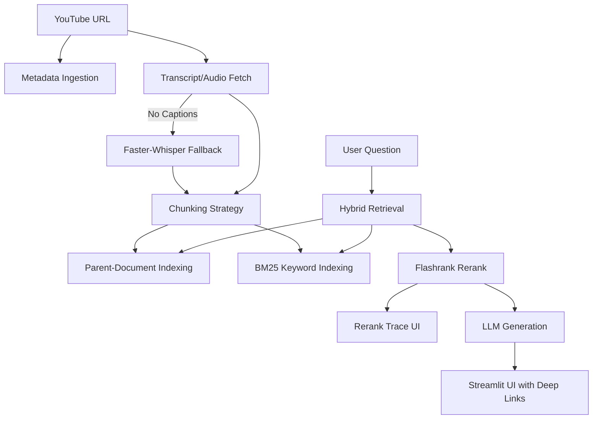

# 🎥 YouTube AI Chatbot: Industry-Grade RAG Pipeline

**The ultimate RAG portfolio project – transforming YouTube transcripts into deep, deep insights with clinical observability.**

This project is a high-performance Retrieval-Augmented Generation (RAG) system that uses **Parent-Document Retrieval**, **Hybrid Search**, and **FlashRank Reranking** to provide precise answers with clickable video timestamps.

---

## 🏆 Key Features

### 1. Executive Summary Dashboard
Get the "bottom line" instantly. Every video is automatically scanned for:
- **The Hook**: A one-sentence essence of the video.
- **Key Takeaways**: 3-4 major factual points.
- **Suggested Question**: A smart conversation starter generated by the AI.

### 2. RAG Observability (Rerank Trace)
No more "Black Box" AI. See exactly how your question is processed:
- **Hybrid Retrieval**: Combines FAISS (Semantic) and BM25 (Keyword) search.
- **FlashRank Diagnostic**: View the **Initial Rank** vs. **Final Rank** and **Relevance Scores** for every piece of context the AI uses.

### 3. Professional-Grade RAG Architecture
- **Parent-Document Retrieval (PDR)**: Uses granular chunks for search but retrieves entire surrounding paragraphs for the LLM, ensuring high context accuracy.
- **Whisper AI Fallback**: If a video lacks captions, the system automatically downloads the audio and transcribes it locally using `Faster-Whisper`.
- **Deep Linking**: Every citation is a clickable link that opens the video at the *exact second* discussed.

---

## 🏗️ Architecture



---

## 🛠️ Tech Stack

- **Framework**: LangChain, Streamlit
- **LLMs**: Mistral-7B (HuggingFace API), Gemini-Pro, Grok
- **Vector DB**: FAISS (Fast In-Memory Search)
- **Reranker**: FlashRank (State-of-the-art cross-encoders)
- **Transcription**: Faster-Whisper, pytubefix

---

## 🏁 Getting Started

### 1. Install Dependencies
```bash
pip install -r requirements.txt
```

### 2. Environment Setup
Create a `.env` file in the root directory:
```env
HUGGINGFACEHUB_API_TOKEN=your_token_here
```

### 3. Run the App
```bash
streamlit run app.py
```

---

## 📊 Scale & Deployment

This architecture is built for scale. By using FAISS for lightning-fast vector search and a decoupled Reranking layer, it can handle large transcript volumes with sub-second response times.
