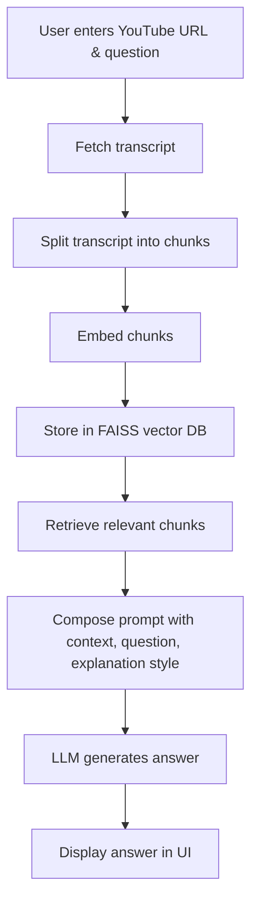

# YouTube Chatbot - RAG Arch.

Ask questions about any YouTube video and get AI-powered answers using Retrieval-Augmented Generation (RAG) with LangChain and Streamlit.

---

## 🚀 Overview

This project is an interactive chatbot that allows you to:
- Paste a YouTube video link
- Ask questions about the video content
- Choose the explanation style (Brief, Medium, In-depth)
- Get answers generated by a Large Language Model (LLM) using only the video transcript as context

Built with:
- [Streamlit](https://streamlit.io/) for the UI
- [LangChain](https://www.langchain.com/) for the RAG pipeline
- [HuggingFace](https://huggingface.co/) for embeddings and LLMs

---

## 🧠 How It Works

1. **User submits a YouTube URL and a question.**
2. The app fetches the video transcript using `youtube-transcript-api`.
3. The transcript is split into manageable chunks.
4. Each chunk is embedded using a sentence transformer model.
5. A vector store (FAISS) is built for fast similarity search.
6. The most relevant transcript chunks are retrieved based on the user’s question.
7. The selected context, question, and explanation style are sent to an LLM (e.g., Mistral-7B-Instruct) via HuggingFace.
8. The LLM generates an answer using only the retrieved context.

---

## 🖥️ Features

- 🎥 **YouTube Video Embedding:** Watch the video directly in the app.
- 🔍 **Ask Anything:** Query any aspect of the video’s content.
- 📝 **Explanation Style:** Choose between Brief, Medium, or In-depth answers.
- 🌈 **Modern UI:** Solid background, centered video, and responsive design.
- ⚡ **Fast Retrieval:** Uses FAISS for efficient context search.
- 🔒 **Secure:** `.env` support for API keys (not committed to GitHub).

---

## 🛠️ Setup & Usage

### 1. **Clone the repository**
```sh
git clone https://github.com/YOUR_USERNAME/YT_CHATBOT.git
cd YT_CHATBOT
```

### 2. **Install dependencies**

```sh
pip install streamlit youtube-transcript-api langchain langchain-community langchain-huggingface huggingface-hub faiss-cpu
```

### 3. **Set up your environment**
- If you use HuggingFace models that require authentication, create a `.env` file and add your token:
  ```
  HUGGINGFACEHUB_API_TOKEN=your_huggingface_token
  ```

### 4. **Run the app**
```sh
streamlit run YT_Chatbot_app.py
```

---

## 🧩 Project Structure

```
YT_CHATBOT/
│
├── YT_Chatbot_app.py         # Streamlit app
├── YT_Chatbot_final.ipynb    # Jupyter notebook for experiments
├── chatbot_logic.py          # (Optional) Core logic
├── .env                      # (Not tracked) API keys
├── .gitignore
└── README.md
```

---

## 🔄 Flow Diagram



---

## 🤖 Technologies Used

- **Python 3.8+**
- **Streamlit**
- **LangChain**
- **HuggingFace Transformers**
- **FAISS**
- **youtube-transcript-api**

---


## 🙏 Acknowledgements

- [CampusX](https://www.youtube.com/@campusx-official)
- [LangChain](https://www.langchain.com/)
- [HuggingFace](https://huggingface.co/)
- [Streamlit](https://streamlit.io/)

---

## ✨ Future Improvements

- Support for multi-language transcripts
- Option
